[TOC]

## 前言

现阶段，shellcode编写门槛高，大多需要有较深的汇编功底，而Metersploit上的Shellcode开源生成框架，功能单一，扩展性差，大多只能在demo中测试使用，难以在实战中发挥作用。

我的这个版本用纯C语言实现了Windows平台下自己的Shellcode生成器，能在实战中根据现实情况，自动生成所需功能的Shellcode。

## 项目预览

整个项目大致如下：后面会讲解每一个文件的作用

## 项目配置

首先来说一下自己的这个项目的设置，本项目使用VS2013编译

1. 编译时选择 realse版本 属性->C/C++->代码生成->运行库->多线程 (/MT)
2. 为了防止编译器自动生成的一系列代码造成的干扰 需要修改入口点 在属性->链接器->高级
3. 属性->C/C++->代码生成->禁用安全检查GS
4. 关闭生成清单 属性->链接器->清单文件->生成清单 选择否
5. 关闭调试信息 属性->链接器->生成调试信息->否
6. 取消SDL安全检查
7. 兼容XP 选择属性->常规->平台工具集->Visual Studio 2013 - Windows XP (v120_xp)
8. C/C++优化 优化->使大小最小化 (/O1) 优化大小或速度->代码大小优先 (/Os)

## 文件命名与作用

我的这个框架分为两个部分，一个是ShellCode的生成部分，还有一个是ShellCode部分

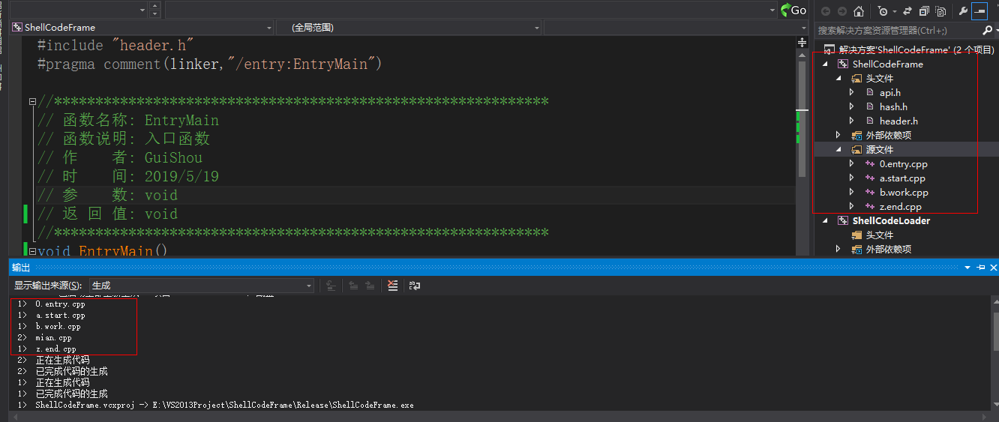

之所以采用这样的文件命名的方式是为了方便计算ShellCoede的大小。文件的编译顺序就是编译后的exe函数的排列顺序。具体来说这个项目的文件编译顺序是0.entry.cpp->a.start.cpp->b.work.cpp->z.end.cpp(main.cpp是另外一个工程)，那么代码段中的函数排列顺序也会和文件的编译顺序一致  下面说一下每个文件的作用

- api.h->存放所有和api函数相关的结构体及函数指针
- hash.h->存放需要用到的API函数的哈希定义宏
- header.h->存放头文件及函数声明
- 0.entry.cpp->存放ShellCode函数的入口
- a.start.cpp->存放ShellCodeStart(标记一个起始位置)和真正的ShellCode代码
- b.work.cpp->存放ShellCode中的起作用的代码
- z.end.cpp->存放ShellCodeEnd函数(标记一个结束位置)

## ShellCode大小的计算方法

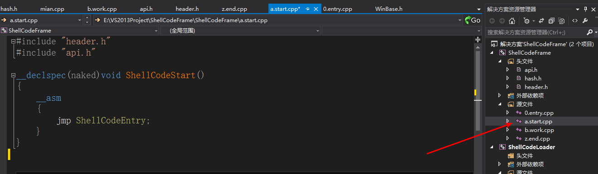

首先我在a.start.cpp中放了一个ShellCodeStart函数，用于标记ShellCode的开始位置

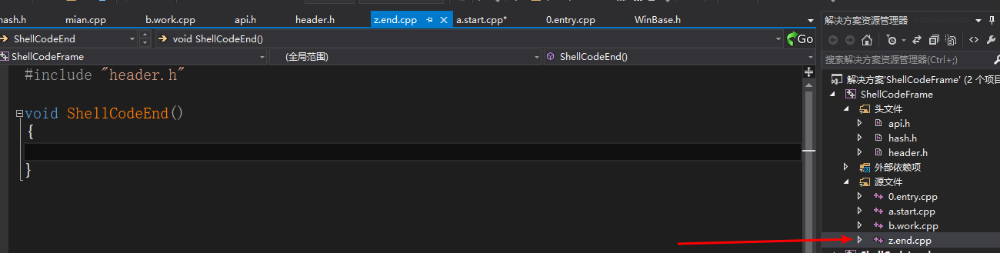

然后在z.end中放了一个ShellCodeEnd函数，用来标记ShellCode的结束位置，然后将真正的ShellCode放在a和z之间

那么根据文件的编译顺序，只需要用ShellCodeEnd函数的位置减去ShellCodeStart函数的位置，就能得到ShellCode的大小

## 第一部分 ShellCode生成

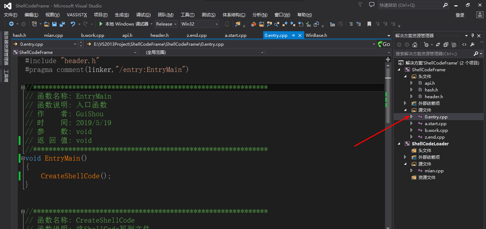

首先来说明ShellCode的生成部分，这个部分在0.entry.cpp中，同时将入口点修改为EntryMain，也就是说这是整个工程的main函数

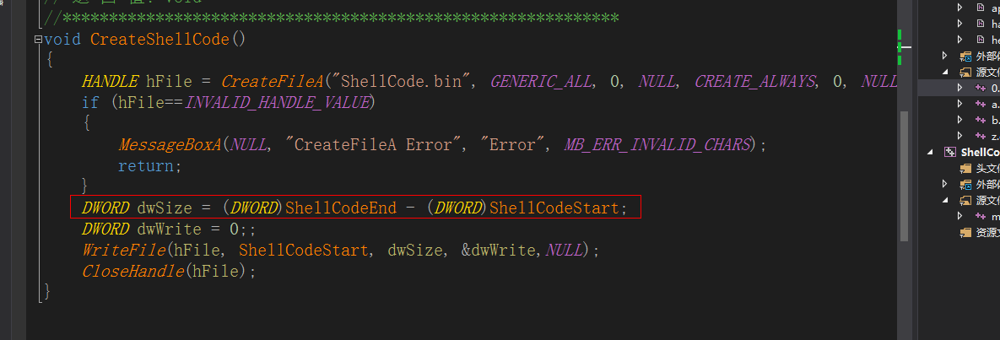

这个ShellCode生成函数会计算ShellCode的大小，然后将ShellCode写到一个二进制文件，可以省去在OD中提取ShellCode的步骤

## 第二部分 ShellCode部分

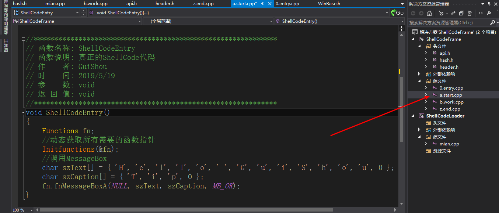

真正的ShellCode代码存放在a.start中的ShellCodeEntry函数里

首先我定义了一个结构体Functions，这个结构体存放所有需要用到的函数指针

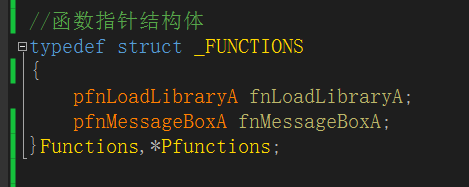

接着通过计算哈希的方式获取到需要的函数地址并将所需要的模块加载进来

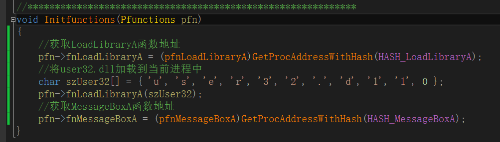

接着调用MessageBox函数

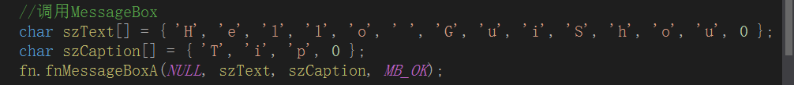

## ShellCode加载器

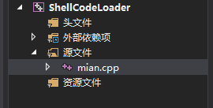

另外我还写了一个ShellCodeLoader用于测试写好的ShellCode，代码相对来说比较简单

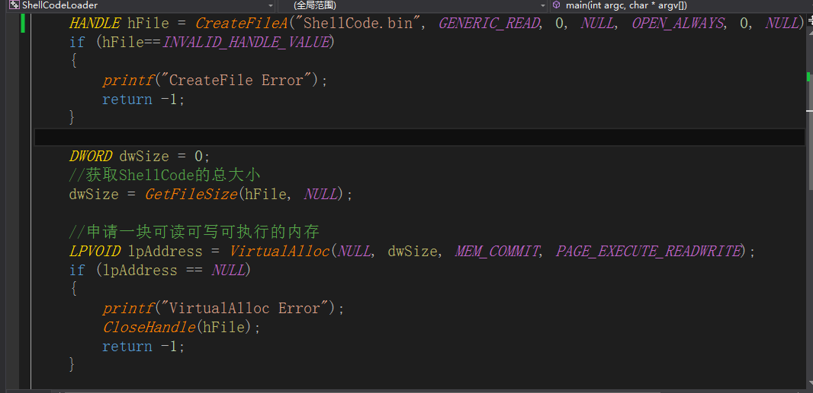

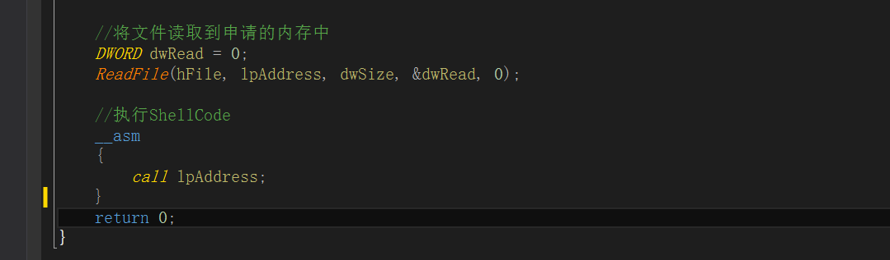

就是将ShellCode读取到内存然后执行

如果你所编写的ShellCode没有文件，当双击ShellCodeLoader时，就会执行生成的ShellCode.bin文件

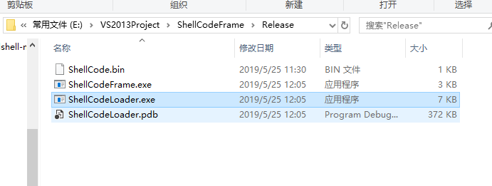

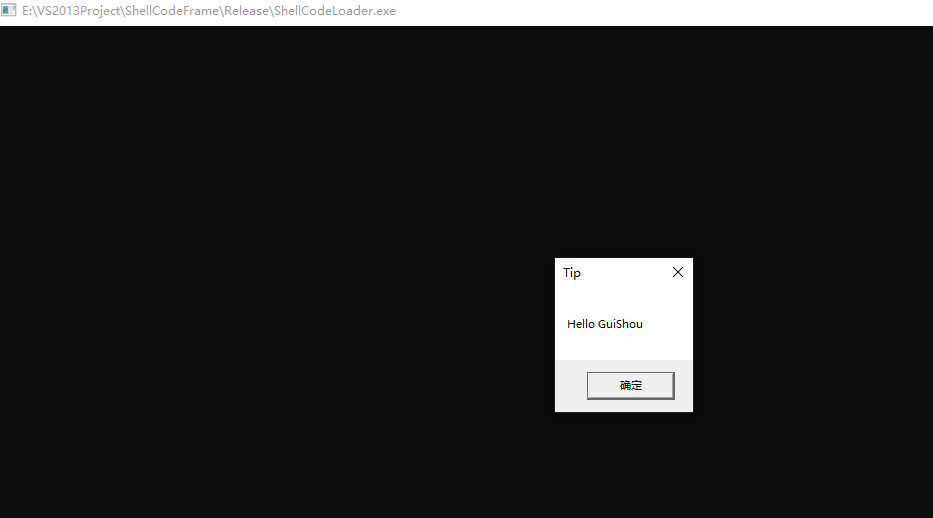

如果执行成功，说明ShellCode没有问题

## 如何提取ShellCode

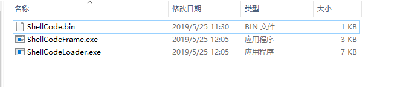

在编写好ShellCode之后点击ShellCodeFrame.exe会生成ShellCode.bin，然后用二进制文件打开ShellCode.bin，复制所有代码即可

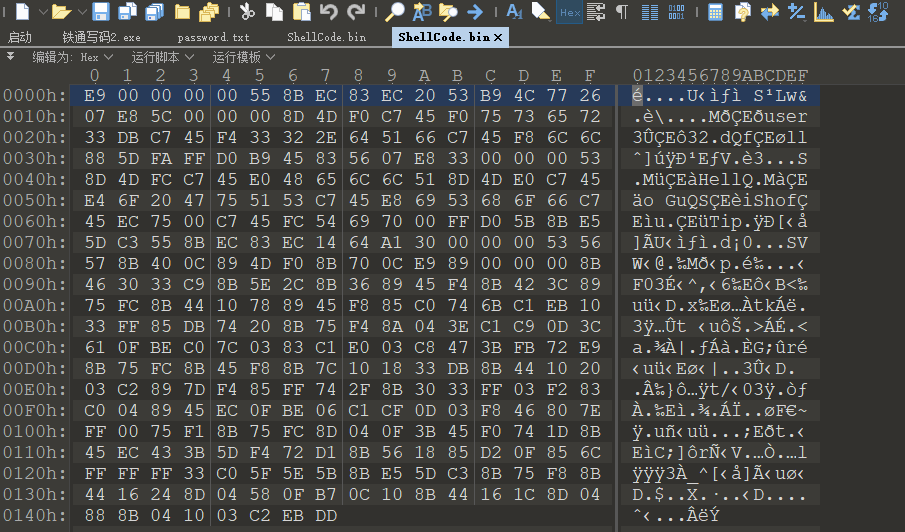

## 如何扩展ShellCode框架？

我的这个框架并只写了一个示例的MessageBox函数，具体扩展的步骤如下：

1. 在api.h中定义所需要的函数指针，并将函数指针存放到结构体

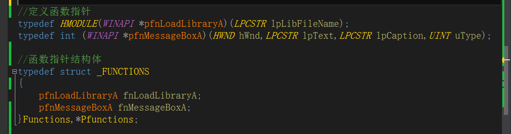

2. 在hash.h中定义需要用的到函数的哈希值

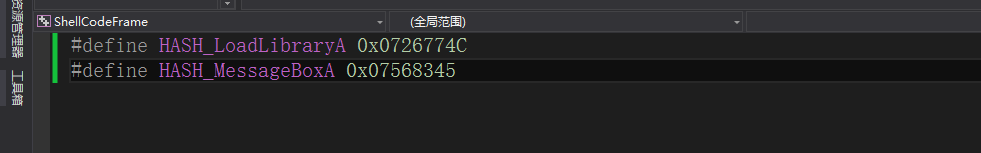

3. 在b.work的Initfunctions函数中获取函数指针和加载需要的模块

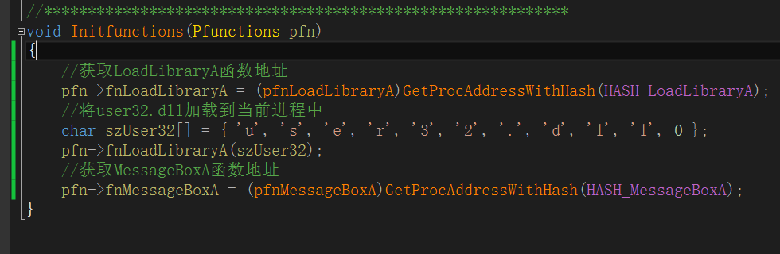

4. 在ShellCodeEntry中调用函数

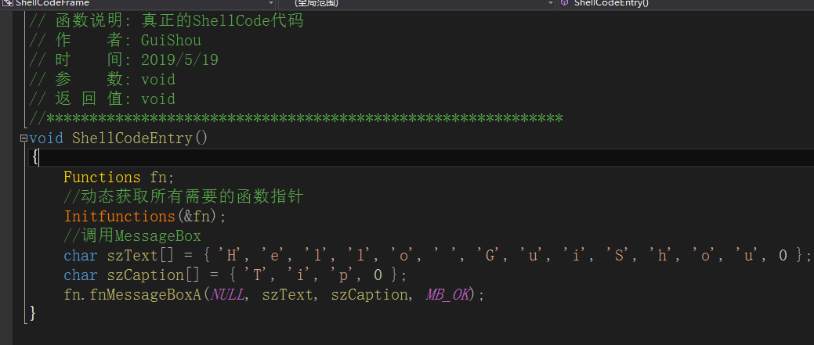

## 参考资料

《Windows平台高效Shellcode编程技术实战》

PIC_BINDSHELL(Github)：
<https://github.com/mattifestation/PIC_Bindshell>

## 项目下载

<https://github.com/TonyChen56/ShellCodeFrame>